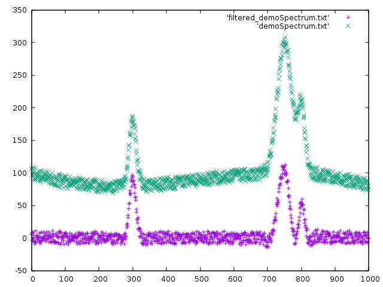

arPLS implements the algorithm for smoothing of Raman spectra from:

Sung-June Baek,  Aaron Park,  Young-Jin Ahna and Jaebum Choo:
"Baseline correction using asymmetrically reweighted penalized least
squares smoothing", Analyst, 2015,140, 250-257 

This is an improved algorithm compared to https://github.com/zmzhang/airPLS

The implementation uses linear algebra for sparse matrices from alglib
(http://www.alglib.net). Alglib is licensed under GPL2+. Commercial licenses are available.

Compile:
  `make arPls`
  
Run:
  `arPLS demoSpectrum.txt 1000`

